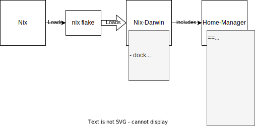

# layout
```
- config: all config files per program
- home-manager: home-manager nix which consumes config dir
- my-nix-darwin: darwin macos config stuff

```


### nix/nix-darwin/home-manager structure

